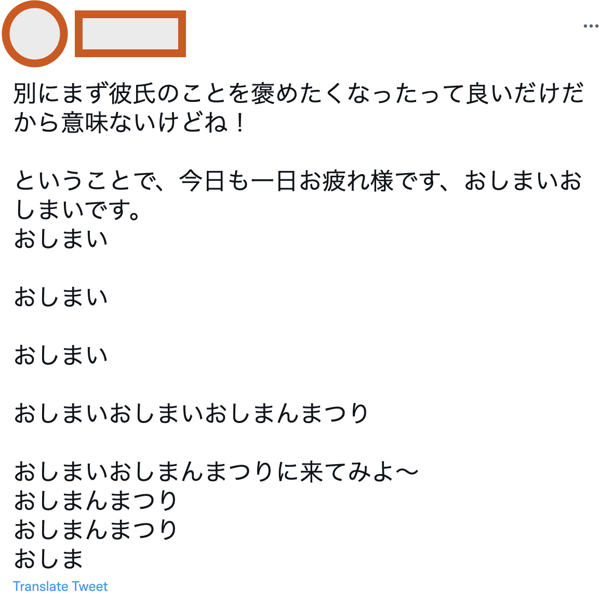

<h1 align="center">
  
  <br>
  <br>
  Text Generator Powered by GPT2-JA
</h1>

<p>
  
  
</p>

<h4 align="center">
  Easy to use scripts to fine-tune GPT-2 Japanese model with your own text, to generate sentences, and to tweet them automatically.
  <br>
</h4>

# Installation

### 1. Clone this repository

```zsh
$ git clone https://github.com/discus0434/text-generation.git
$ cd text-generation
```

### 2. Install dependencies

#### pip

```zsh
$ pip install -r requirements.txt
```

#### conda

```zsh
$ conda create -n textgen python=3.9
$ echo "source activate textgen" > ~/.bashrc
$ conda run -n textgen pip install -r requirements.txt
```

#### ...or build docker image

```zsh
$ docker build text-generation/. -t textgen
$ docker run -it --runtime=nvidia -d --restart=always textgen:latest bash
```

### 3. Run `setup.sh` (not necessary for docker users)

Modify permission of shell scripts

```zsh
$ chmod +x scripts/shell/setup.sh
$ chmod +x scripts/shell/finetune.sh
$ chmod +x scripts/shell/generate.sh
```

Run `setup.sh` to download a pretrained model

```zsh
$ scripts/shell/setup.sh
```

### 4. Arrange Twitter API tokens (not necessary if you do not interact with Twitter)

Arrange a `.env` file in the project directory.
`.env` file should look like this:

```
API_KEY = XXX
API_SECRET_KEY = XXX
BEARER_TOKEN = XXX
ACCESS_TOKEN = XXX
ACCESS_TOKEN_SECRET = XXX
```

# Usage

You can not only make Twitter Bot but just generate sentences.

## Preparation

Arrange your text file you want to use in `sample_texts/`.
```zsh
$ mv <your text file>.txt sample_texts/
```

...or download tweets with Python script

```zsh
$ python ./scripts/python/download_tweets.py -u <Twitter user ID> -max <number of tweets you will get>
```

## Usage 1: Just generate sentences

#### Fine-tuning

```zsh
$ scripts/shell/finetune.sh
```
### Generate 10 sentences with your fine-tuned model

```zsh
$ scripts/shell/generate.sh
```

## Usage 2: Manage a Twitter bot powered by fine-tuned GPT-2-JA

### Fine-tuning and generate tweet
<br>

...Run all of cells in `create_tweet.ipynb`.

<br>

### Fine-tuning and generate tweets per 30 min till interrupted

```zsh
python ./scripts/python/create_tweets.py & disown
```

# Acknowledgements

This code borrows from [gpt2-japanese](https://github.com/tanreinama/gpt2-japanese).
